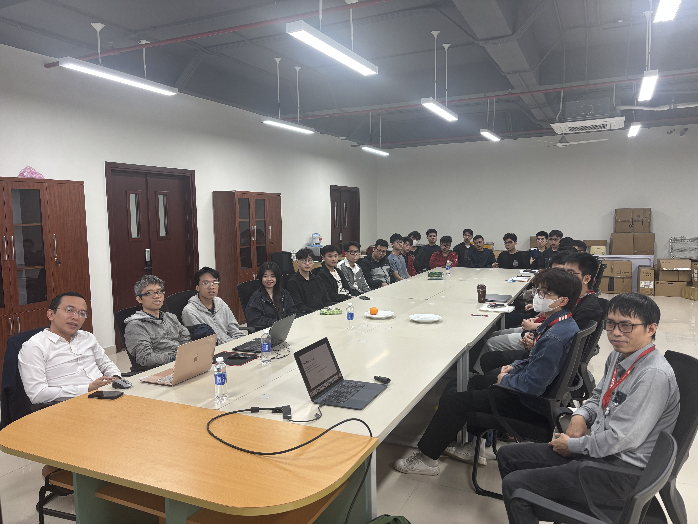
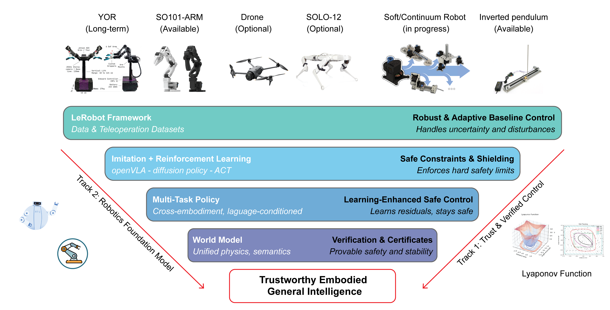

## Project Overview

This project develops **trustworthy embodied intelligence** for real-world robotics, with safety, robustness, and reliability as first-class design goals.  
Instead of optimizing only for task completion, we build systems that can reason, act, and recover under uncertainty while respecting explicit safety constraints.

Our framework combines **robotic foundation models**, **learning-enhanced safe control**, and **formal verification** so that perception, decision-making, and low-level control are aligned in a single dependable stack.

## Master Plan & Research Tracks

The AI-Robotics master plan is organized around two tightly coupled research tracks:

- **Track 1 – Trust & Verified Control**  
  - Robust and adaptive baseline control to handle disturbances and model uncertainty  
  - Safe constraints and shielding to enforce hard safety limits  
  - Learning-enhanced safe control that learns residuals while preserving guarantees  
  - Verification and certificates (e.g. Lyapunov functions) for provable stability and safety

- **Track 2 – Robotic Foundation Model**  
  - Data collection and teleoperation datasets under the **LeRobot** framework  
  - Imitation and reinforcement learning with modern policies (e.g. diffusion policies, ACT, openVLA)  
  - Multi-task, cross-embodiment and language-conditioned policies  
  - Unified world models combining physics and semantics for long-horizon reasoning

These tracks jointly support our long-term goal of **Trustworthy Embodied General Intelligence**.

## Key Research Areas

- **Embodied Intelligence Models**: Multimodal perception and policy learning for generalizable robot behaviour  
- **Learning-Enhanced Safe Control**: Combining classical control with learning-based components under safety constraints  
- **Sim-to-Real & Cross-Embodiment Transfer**: Policies that generalize across different robot platforms and environments  
- **World Models & Long-Horizon Planning**: Modeling dynamics and semantics to support predictive, explainable behaviour  
- **Human-Robot Interaction**: Intuitive interfaces for collaboration with non-expert users

## Robotic Platforms

Our research is deployed on a diverse set of platforms:

- **YOR** – long-term platform for large-scale data collection and manipulation  
- **SO101-ARM** – available robotic arm for manipulation and control experiments  
- **Drone** (optional) – aerial robotics for perception and planning under dynamics constraints  
- **SOLO-12** – quadruped platform for locomotion and whole-body control  
- **Soft / Continuum Robots** – in-progress platforms for compliant manipulation  
- **Inverted Pendulum** – available benchmark for fast prototyping of safe and verified control

## Team Members

### Faculty

- **Thầy Nguyễn Thái Minh Tuấn**  
- **Thầy Nguyễn Thái Tất Hoan**  
- **Thầy Phạm Thanh Chung**  
- **Thầy Trương Quốc Chiến**

### Student Members


- Nguyễn Minh Tường
- Nguyễn Đình Hải
- Nguyễn Trọng Giáp
- Vũ Minh Đức



- Nguyễn Việt Anh
- Đồng Anh Quốc
- Phạm Bá Long
- Trần Ngọc Thưởng



- Vương Đức Minh
- Phạm Ngọc Khánh
- Đinh Bảo Sơn
- Lê Anh Đức



- Nguyễn Hải Đăng
- Trần Bình Minh
- Lê Nguyễn Ngọc Vũ
- Đặng Tuấn Anh
- Lê Tiến Đạt




## Publications

- Ngoc, V. L. N., Truong-Quoc, C., & Nguyen-Thai, M.-T. (2025). **Exploring PD Control Effects on the Basins of Attraction in Segway Dynamics**. *Proceedings of the 8th International Conference on Engineering Mechanics and Automation (ICEMA 2025), Hanoi, November 14-15, 2025*. DOI: [10.15625/vap.2026.0011](https://doi.org/10.15625/vap.2026.0011)
